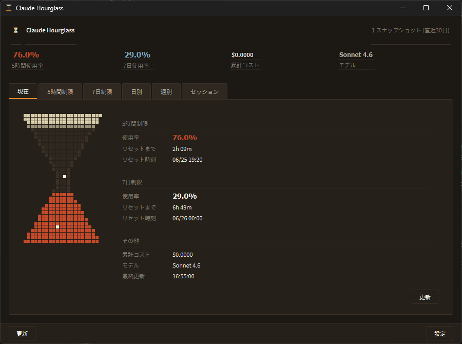
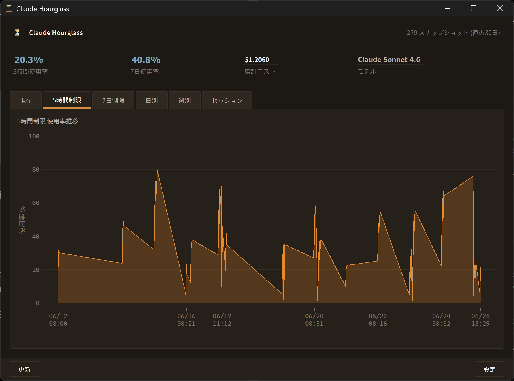
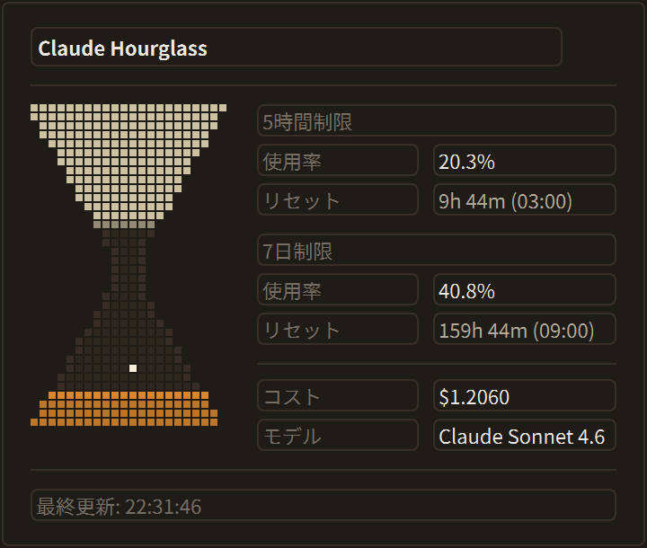

# Claude Hourglass ⏳

Claude Code の使用制限を Windows タスクトレイから砂時計風に確認できる常駐アプリ。

## Screenshots

### Current status



### Usage history



### Tray panel



## 機能

| 機能 | 概要 |
|------|------|
| トレイ常駐 | 使用率に応じて色が変わるピクセルアート砂時計アイコン |
| ホバーツールチップ | 5時間制限・7日制限の使用率とリセット時刻 |
| クリックパネル | 砂時計アニメーション + 詳細メトリクス |
| 履歴グラフ | 日別・週別・セッション別 (pyqtgraph) |
| データ保存 | SQLite + latest_usage.json |
| statusLine フック | Claude Code から自動収集 |

## セットアップ

```bash
# 仮想環境を作成して有効化 (推奨)
python -m venv .venv
.venv\Scripts\activate          # Windows

# 依存パッケージをインストール
pip install -r requirements.txt

# WebView 公式UI連携を使う場合は追加でインストール
pip install PySide6-WebEngine

# サンプルデータを生成して動作確認 (任意)
python scripts/seed_data.py --days 14

# アプリを起動
python -m claude_hourglass.main
# または .venv から直接起動する場合:
.venv\Scripts\python.exe -m claude_hourglass.main
```

## Claude Code との連携

### 仕組み

Claude Code の `statusLine` 設定に登録したコマンドは、**ターン毎に Claude Code から呼び出され**、
現在のセッション情報（レート制限・コスト・モデルなど）を **stdin に JSON として受け取ります**。
コマンドが stdout に出力したテキストは Claude Code のステータスバーに表示されます。

`save_usage.py` はこのフローを利用して:
1. stdin から JSON を読み込む
2. `usage.sqlite` にスナップショットを保存する
3. `latest_usage.json` を上書きする（トレイアプリが参照）
4. 現在の使用率を stdout に出力する（ステータスバーに表示）

### 設定方法

`.claude/settings.json` に `statusLine` を追加します:

```json
{
  "statusLine": "python C:/path/to/claude-hourglass/statusline_hook/save_usage.py"
}
```

Windows で `python` が PATH に入っていない場合はフルパスを指定してください:

```json
{
  "statusLine": "C:/Users/yourname/AppData/Local/Programs/Python/Python312/python.exe C:/path/to/claude-hourglass/statusline_hook/save_usage.py"
}
```

設定後、Claude Code を再起動するとステータスバーに以下のように表示されます:

```
[Hourglass] 5h 42.5% | 7d 18.0%
```

### statusLine が受け取る JSON 形式

```json
{
  "captured_at": "2026-06-25T12:34:56Z",
  "session_id": "abc-123",
  "model": { "display_name": "Claude Sonnet 4.6" },
  "rate_limits": {
    "five_hour": { "used_percentage": 42.5, "resets_at": "2026-06-25T17:00:00Z" },
    "seven_day": { "used_percentage": 18.0, "resets_at": "2026-07-01T00:00:00Z" }
  },
  "cost": { "total_cost_usd": 0.1234 },
  "context_window": { "current_usage": 45000 },
  "version": "1.0.0"
}
```

### 手動テスト

```bash
echo '{"captured_at":"2026-06-25T12:00:00Z","rate_limits":{"five_hour":{"used_percentage":55.0,"resets_at":"2026-06-25T17:00:00Z"},"seven_day":{"used_percentage":20.0,"resets_at":"2026-07-01T00:00:00Z"}},"cost":{"total_cost_usd":0.25},"model":{"display_name":"Claude Sonnet 4.6"}}' | python statusline_hook/save_usage.py
```

## Official UI Reader (Tampermonkey)

Claude 公式設定画面の使用率を直接読み取り、Claude Hourglass に送信する Userscript です。
`statusLine` フックが取得できない値（公式UI 上の表示と一致した数値）をブラウザ経由で補完します。

### 仕組み

```
Claude.ai 設定画面
  └─ Tampermonkey userscript
       └─ DOM テキストから使用率・リセット時刻を抽出
            └─ POST http://127.0.0.1:43871/ingest/official-usage
                 └─ receiver.py → latest_official_ui.json
                      └─ sources.py が優先度マージ → latest_usage.json
                           └─ トレイアプリに反映
```

優先度: **official_ui (5分以内)** > statusLine best-state > stale

### インストール手順

1. **Claude Hourglass を起動する**（receiver が `127.0.0.1:43871` で待ち受けます）

2. **Tampermonkey をインストール**
   - Chrome: [Chrome Web Store](https://www.google.com/search?q=tampermonkey+chrome+extension)
   - Edge: [Edge Add-ons](https://www.google.com/search?q=tampermonkey+edge+extension)

3. **userscript をインストール**
   Tampermonkey ダッシュボード → 「新規スクリプト」を開き、
   `tools/official_ui_reader/claude_hourglass_official_ui.user.js` の内容を貼り付けて保存。

4. **Claude の使用量設定ページを開く**
   `https://claude.ai/settings/usage` または設定画面の使用量セクションへ移動。

5. ページを開いた状態で約 2 秒後に自動送信が始まります。
   ブラウザの開発者ツール (Console) で以下のログが確認できます:
   ```
   [ClaudeHourglass] sent OK 200 {five_hour: {…}, seven_day: {…}}
   ```

### 動作仕様

| 項目 | 値 |
|------|----|
| 送信間隔 | 45 秒 |
| 送信先 | `http://127.0.0.1:43871/ingest/official-usage` |
| 抽出方法 | `document.body.innerText` から正規表現 |
| 失敗時 | `console.debug` にエラー出力（アプリに影響なし） |

### 抽出するデータ

日本語 UI・英語 UI の両方に対応しています。

| フィールド | 検出するセクションヘッダ | 使用率テキスト例 |
|-----------|----------------------|----------------|
| `five_hour.used_percentage` | "現在のセッション" / "Current session" | `52% 使用済み` / `52% used` / `52%` |
| `five_hour.resets_at` | 同上セクション内の reset 行 | 後述 |
| `seven_day.used_percentage` | "すべてのモデル" / "All models" | 同上 |
| `seven_day.resets_at` | 同上セクション内の reset 行 | 後述 |

**リセット時刻テキストの対応形式:**

| テキスト例 | 変換結果 |
|-----------|---------|
| `1時間57分後にリセット` | 現在時刻 + 1h57m |
| `1日2時間後にリセット` | 現在時刻 + 26h |
| `2日 3時間 15分後にリセット` | 現在時刻 + 51h15m |
| `たった今` / `リセット済み` | 現在時刻 (リセット済みとして扱う) |
| `Resets in 4 hours 23 minutes` | 現在時刻 + 4h23m |
| `Resets in 3 days 4 hours` | 現在時刻 + 76h |
| `just now` | 現在時刻 (already reset) |

**デバッグ出力例** (ブラウザ Console):
```
[Claude Hourglass] official usage parsed:
  five_hour=52  reset_line="1時間57分後にリセット"  resets_at=2026-06-25T14:57:00Z
  seven_day=37  reset_line="1時間37分後にリセット"  resets_at=2026-06-25T14:37:00Z
[Claude Hourglass] sent OK 200 {five_hour: {…}, seven_day: {…}}
```

> **注意**: Claude の UI が変更された場合は、userscript 内の `findSection()` キーワードを
> 実際の DOM テキストに合わせて修正してください。

### トラブルシューティング

| 症状 | 対処 |
|------|------|
| `receiver unreachable` | Claude Hourglass が起動していることを確認 |
| `usage data not found` | 使用量が表示されているページ上で実行されているか確認 |
| データが古いまま | トレイアプリのポーリング間隔（デフォルト 30 秒）を待つ |

### receiver のポート変更

デフォルトポートは `43871` です。変更する場合:

1. `~/.claude_hourglass/config.json` に `"receiver_port": <新ポート>` を追加
2. userscript の `RECEIVER_URL` の末尾ポートも同じ値に変更
3. Claude Hourglass を再起動

---

## QtWebEngine WebView 収集 (組み込みブラウザ)

Tampermonkey が不要な代替データソースです。Claude Hourglass に組み込まれた
`QWebEngineView` が定期的に `claude.ai/settings/usage` を読み込み使用データを抽出します。

### 前提

```bash
pip install PySide6-WebEngine
```

### 有効化手順

1. **設定画面を開く** (トレイ右クリック → 設定)
2. **「公式UI連携 (WebView)」グループ** の「QtWebEngine で使用量を定期取得する」をチェック
3. **「ログインウィンドウを開く」** をクリックしてブラウザウィンドウで Claude.ai にログイン
4. ログイン完了後「ログイン完了」ボタンを押す
5. 設定ダイアログで OK → アプリ再起動

Cookie は `~/.claude_hourglass/webview_profile/` に永続保存されるため、
次回以降の起動時はログイン不要です。

### 動作仕様

| 項目 | 値 |
|------|----|
| 取得間隔 | 60 秒 (設定変更可) |
| Cookie 保存先 | `~/.claude_hourglass/webview_profile/` |
| ステータスファイル | `~/.claude_hourglass/official_webview_status.json` |
| 抽出ロジック | Tampermonkey userscript と同一 (JS ポート) |
| WebEngine 未インストール時 | フォールバック: データ収集なし、設定 UI は表示 |

### ステータス表示

現在タブ「公式UI連携 (WebView)」カードに以下のいずれかが表示されます:

| 状態 | 説明 |
|------|------|
| 待機中 | まだ収集を開始していない |
| 取得OK | 正常に使用データを取得した |
| ログインが必要です | 「ログインを開く」ボタンでログインしてください |
| データ取得失敗 | ページはロードできたが使用データが見つからない |
| WebEngine 未インストール | pip install PySide6-WebEngine が必要 |

### 動作確認スクリプト

```bash
python scripts/probe_official_webview.py
```

ブラウザウィンドウが開きます。未ログインの場合はウィンドウ内でログインすると
次回起動から Cookie が再利用されます。

### 成功確認

取得が成功すると `~/.claude_hourglass/latest_usage.json` に以下のフィールドが出力されます:

```powershell
# PowerShell で確認
$j = Get-Content "$env:USERPROFILE\.claude_hourglass\latest_usage.json" | ConvertFrom-Json
$j.source          # "official_ui"
$j.source_detail   # "webview"
$j.rate_limits.five_hour.used_percentage  # 例: 42
$j.rate_limits.seven_day.used_percentage  # 例: 5
```

WebView コレクターのステータスは別ファイルで確認できます:

```powershell
$s = Get-Content "$env:USERPROFILE\.claude_hourglass\official_webview_status.json" | ConvertFrom-Json
$s.status          # "ok" なら成功
$s.last_success_at # 最終取得時刻 (UTC)
$s.last_success_payload_summary  # 取得した使用率のサマリ
```

| status 値 | 意味 | 対処 |
|-----------|------|------|
| `ok` | 正常取得 | — |
| `login_required` | 未ログイン | 「ログインを開く」ボタンからログイン |
| `usage_section_not_found` | ページにデータなし | Claude.ai の表示が変わった可能性あり |
| `parse_failed` | JS抽出失敗 | `inner_text_head` / `possibleUsageTexts` を確認 |
| `webengine_missing` | ライブラリ未インストール | `pip install PySide6-WebEngine` |

---

## Windows 自動起動

アプリ起動後に **設定画面**（トレイアイコン右クリック → 設定）を開き、
「Windows ログオン時に Claude Hourglass を自動起動する」をチェックして OK を押してください。

### 内部動作

1. VBS ランチャーを `~/.claude_hourglass/launch_hourglass.vbs` に生成する
2. レジストリキー `HKCU\Software\Microsoft\Windows\CurrentVersion\Run` に以下を登録する

```
ClaudeHourglass = wscript.exe "C:\Users\<name>\.claude_hourglass\launch_hourglass.vbs"
```

VBS ランチャーは作業ディレクトリをプロジェクトルートに設定したうえで `pythonw.exe` でコンソールなし起動します。

### 注意

- 管理者権限は不要（`HKCU` = 現在ユーザーのみ）
- VBS ファイルはアプリが自動生成するため手動編集は不要
- Python 環境を変えた場合は一度 OFF → ON で再登録してください
- PyInstaller 等で EXE 化した場合は VBS を経由せず EXE パスが直接登録されます

### 手動での確認・削除

レジストリエディター (`regedit`) で以下を確認できます:

```
HKEY_CURRENT_USER\Software\Microsoft\Windows\CurrentVersion\Run
└── ClaudeHourglass
```

## ファイル構成

```
claude-hourglass/
├── claude_hourglass/          # メインアプリパッケージ
│   ├── main.py                # エントリポイント
│   ├── tray.py                # タスクトレイ管理
│   ├── config.py              # 設定管理
│   ├── database.py            # SQLite 操作
│   ├── models.py              # データモデル
│   ├── sources.py             # マルチソース優先度マージ (build_latest_json)
│   ├── receiver.py            # ローカル HTTP 受信サーバー (port 43871)
│   ├── official_ingest.py     # 共有インジェスト関数 (receiver / WebView 共用)
│   ├── official_webview_collector.py  # QtWebEngine 定期収集 + NullCollector
│   ├── resources.py           # リソースパス解決 + draw_hourglass() 描画関数
│   ├── startup.py             # 自動起動の登録・解除 (VBS生成 + レジストリ)
│   ├── assets/
│   │   ├── icon.svg           # SVG ソース (デザイン原本)
│   │   ├── icon_16.png        # 生成済み PNG (generate_icons.py で再生成可)
│   │   ├── icon_32.png
│   │   ├── icon_48.png
│   │   ├── icon_256.png
│   │   └── icon.ico           # Windows 用 ICO (16/32/48/256px を内包)
│   └── ui/
│       ├── theme.py           # カラーパレット・スタイルシート
│       ├── hourglass_panel.py # クリックパネル
│       ├── main_window.py     # メイン画面
│       ├── settings_dialog.py # 設定ダイアログ
│       ├── official_login_window.py # Claude.ai ログイン用 WebView ウィンドウ
│       └── widgets/
│           ├── hourglass_widget.py  # 砂時計アニメーション
│           ├── usage_chart.py       # グラフウィジェット
│           └── current_status_tab.py    # 現在タブ (使用状況カード)
├── statusline_hook/
│   └── save_usage.py          # データ受信・保存スクリプト
├── tools/
│   └── official_ui_reader/
│       └── claude_hourglass_official_ui.user.js  # Tampermonkey userscript
├── scripts/
│   ├── generate_icons.py      # アイコン PNG/ICO を再生成するスクリプト
│   ├── seed_data.py           # サンプルデータ生成
│   └── probe_official_webview.py  # WebView 抽出の動作確認スクリプト
├── Docs/
│   └── 仕様.md
├── requirements.txt
└── pyproject.toml
```

## アイコン資産

アイコンファイルは `claude_hourglass/assets/` に配置されています。

| ファイル | 用途 |
|----------|------|
| `icon.svg` | SVG ソース（デザイン原本、再生成の基準） |
| `icon_16/32/48/256.png` | 各サイズの PNG（コミット済み） |
| `icon.ico` | Windows 用 ICO（16/32/48/256px を内包） |

Python 環境を変えた場合や SVG を修正した場合は再生成できます:

```bash
python scripts/generate_icons.py
```

描画関数 `draw_hourglass()` は `resources.py` で定義しており、
静的アイコン生成とトレイアイコンの動的描画（使用率による色変化）を共有しています。
PyInstaller でパッケージ化する場合も `resources.py` の `resource_path()` が
`sys._MEIPASS` を自動参照するため、パス解決は変更不要です。

## データの保存先

デフォルトは `~/.claude_hourglass/` 以下:

| ファイル | 内容 |
|----------|------|
| `usage.sqlite` | スナップショット履歴 |
| `latest_usage.json` | 最新状態・優先度マージ済み (トレイアプリがポーリング) |
| `latest_statusline_raw.json` | statusLine フックからの最新データ |
| `latest_official_ui.json` | Official UI Reader / WebView からの最新データ |
| `official_webview_status.json` | WebView 収集の最新ステータス |
| `webview_profile/` | WebView 用 Cookie・キャッシュ (永続) |
| `config.json` | アプリ設定 |
| `statusline_debug.log` | statusLine フックのデバッグログ |
| `launch_hourglass.vbs` | 自動起動用 VBS ランチャー（設定画面から生成） |

設定画面から変更可能。

## グラフについての注意

`rate_limits.*.used_percentage` は現在の制限枠に対する使用率であり、
日別・週別グラフは **使用率の推移** として表示しています (厳密な利用量ではありません)。
`cost.total_cost_usd` の差分から将来的により精度の高い推定を追加予定。

## デザイン

- 背景: ダークブラウン (`#1C1814`)
- 文字: クリーム色 (`#F5F0E8`)
- アクセント: オレンジ (`#E8892A`) / アンバー (`#C4782A`) / ブルー (`#7BA7C2`)
- フォント: IBM Plex Sans JP / JetBrains Mono (フォールバックあり)
- 砂時計: ドットグリッドで粒状感を表現、使用率に応じて色変化

## 要件

- Python 3.10+
- Windows 10/11
- PySide6 >= 6.6
- pyqtgraph >= 0.13
